# Ejercicio 6 — Trabajo con Bases de Datos Biológicas
**Gen:** HTT (Huntingtin) · **Enfermedad:** Enfermedad de Huntington (OMIM #143100)
**NCBI Gene ID:** 3064 · **UniProt:** P42858 · **Ensembl:** ENSG00000197386

*Datos verificados contra las bases en vivo en junio de 2026. Como las bases se actualizan
periódicamente, los conteos podrían variar en el futuro.*

---

## a) Gen / proteína de interés — NCBI Gene

**Link Entrez Gene:** https://www.ncbi.nlm.nih.gov/gene/3064

Entramos a la página del gen en NCBI Gene y de ahí sacamos los datos principales. El gen se llama
**HTT** (Huntingtin) y tiene el ID **3064**. Está en el **cromosoma 4** (posición 4p16.3) y es un
gen bastante grande: ocupa unas 180 kb y está formado por **67 exones**.

Este gen tiene las instrucciones para fabricar una proteína llamada **huntingtina**. Por lo que
leímos, la huntingtina aparece sobre todo en el cerebro y es importante para que las neuronas
funcionen bien. Cuando el gen tiene un error (una parte de su secuencia, el "CAG", se repite de más),
la proteína sale defectuosa y termina dañando a las neuronas, lo que produce la enfermedad de
Huntington.

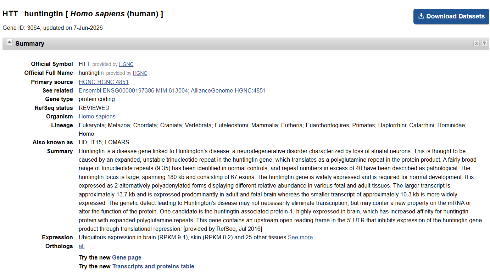

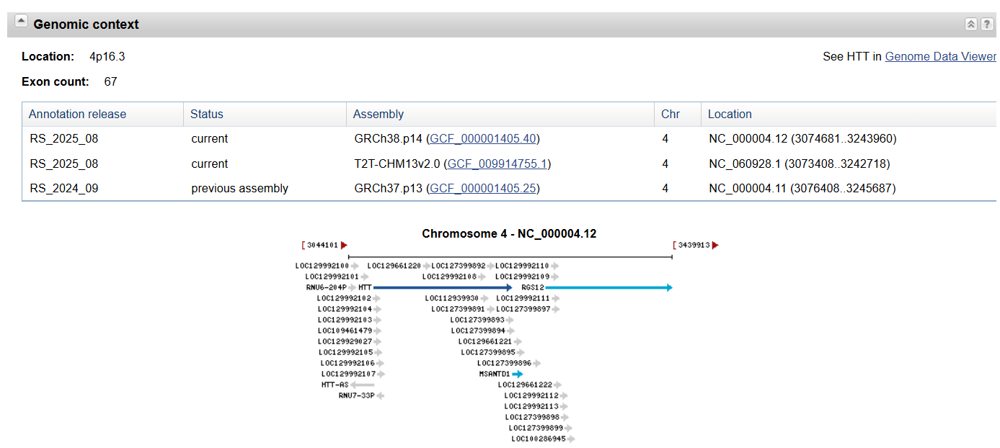

**Por qué la elegimos:** es una enfermedad **conocida y reconocible** —aparece, por ejemplo, como
diagnóstico en la serie *Dr. House*—, lo que nos motivó a investigarla. Además es **hereditaria**,
con una causa genética clara y bien documentada, lo que la hace ideal para trabajar con herramientas
bioinformáticas.

---

## b) Genes / proteínas homólogas en otros organismos

Buscamos en dos bases distintas para ver en cuántos otros organismos existe un gen parecido a HTT.

Primero, una aclaración nuestra para entender qué estábamos buscando. Un **ortólogo** es el mismo gen,
pero en otra especie. Lo vimos clarísimo en el Ejercicio 2: cuando comparamos la proteína humana de
HTT contra una base de datos, encontramos proteínas casi iguales en otros animales —en el ratón
coincidía un **91%**, en la rata un **91%** y hasta en un pez un **70%**—. No son idénticas a la
humana, pero son tan parecidas y hacen lo mismo que claramente son "la misma" proteína en cada animal.
Eso es un ortólogo: la versión de un gen en otra especie. Por eso, contar cuántos ortólogos tiene HTT
es ver en cuántos animales aparece este mismo gen; y como aparece en muchísimos, sabemos que es un gen
importante que se mantuvo a lo largo de la evolución.

**HomoloGene (NCBI):** quisimos usarla, pero descubrimos que **NCBI la dio de baja**. Hoy, al entrar,
te redirige automáticamente a **NCBI Datasets / Gene**. Según el anuncio oficial de NCBI esto pasó el
**30 de enero de 2024**, porque la reemplazaron por una herramienta nueva (NCBI Orthologs) que cubre
más genes y más organismos ([anuncio](https://ncbiinsights.ncbi.nlm.nih.gov/2024/01/30/homologene-redirects-ncbi-datasets-gene/)).
O sea que HomoloGene quedó vieja y ya no se puede usar directamente — un buen ejemplo de cómo las
bases biológicas se van actualizando y reemplazando.

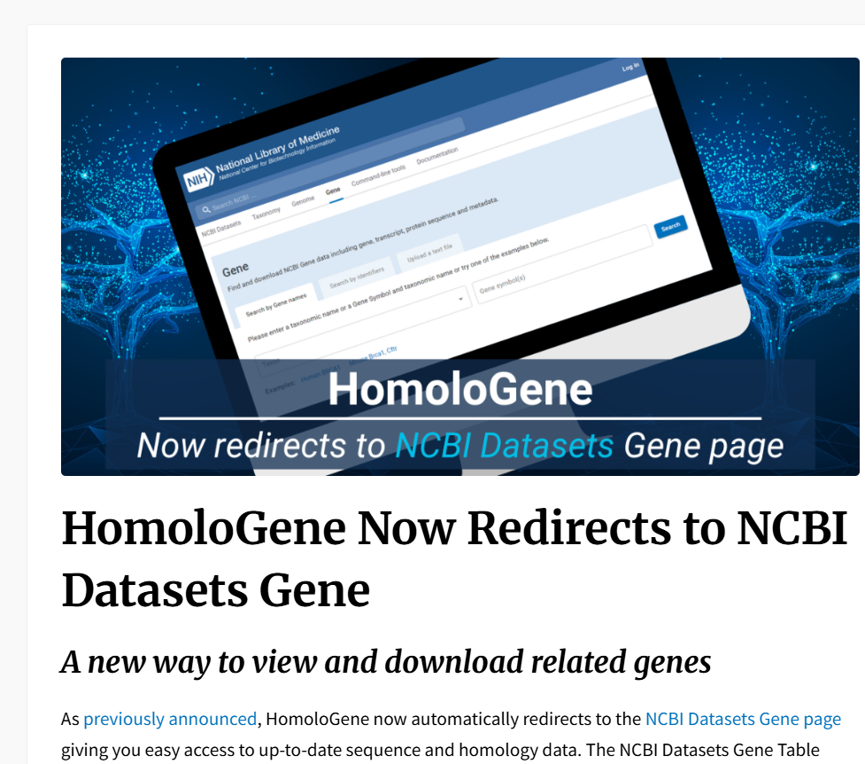

**NCBI Orthologs (el reemplazo de HomoloGene):** https://www.ncbi.nlm.nih.gov/datasets/gene/3064/#orthologs
Acá sí encontramos los datos. NCBI lista **849 genes ortólogos** de HTT, es decir, versiones de este
mismo gen repartidas en muchísimas especies distintas.

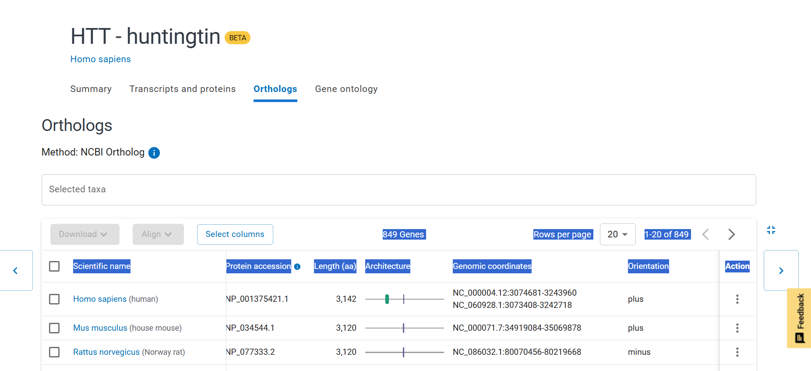

**Ensembl (Comparative Genomics / orthologues):**
https://www.ensembl.org/Homo_sapiens/Gene/Compara_Ortholog?g=ENSG00000197386
Esta base sí está activa. Comparó el gen HTT contra **199 especies** y encontró que tiene un gen
equivalente (ortólogo) en **190 de ellas**:

| Tipo de relación | Qué significa | Especies |
|------------------|---------------|----------|
| 1:1 | un gen humano = un gen en la otra especie | **180** |
| 1:varios | un gen humano = varios en la otra (duplicaciones) | 10 |
| sin ortólogo | no se encontró equivalente | 9 |

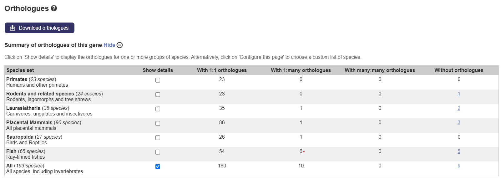

**Diferencia entre las bases:** HomoloGene era una base vieja y estática, y NCBI ya la discontinuó.
Sus dos reemplazos —**NCBI Orthologs** y **Ensembl**— están actualizados y comparan automáticamente
contra muchísimas especies. Una aclaración importante: los números no se comparan directamente porque
cada base cuenta cosas distintas. NCBI cuenta **genes** (849, contando varias especies y a veces más
de un gen por especie), mientras que Ensembl cuenta **especies** (199 comparadas, con ortólogo en 190).
Más allá del número exacto, las dos coinciden en lo mismo: HTT aparece en una enorme cantidad de
organismos.

**Qué tan común es el gen y grupos taxonómicos:** el resultado de Ensembl (ortólogo en 190 de 199
especies, casi todos 1:1) muestra que HTT está **muy conservado en todos los vertebrados**. Además,
en el Ejercicio 2 (BLAST) habíamos encontrado un homólogo hasta en *Dictyostelium discoideum* (una
ameba, 28.8% de identidad), lo que indica que el gen es **muy antiguo**: existe desde mucho antes de
los vertebrados y aparece en eucariotas en general, no sólo en animales.

---

## c) Transcriptos y splicing alternativo

Antes que nada, qué es esto en simple: un **gen** es como una receta. A veces, de la misma receta, la
célula puede armar **versiones distintas** del plato (cambiando o salteando algunos pasos). Cada
versión es un **transcripto**, y esa "edición" de la receta se llama **splicing alternativo**. Acá lo
que hicimos fue ver cuántas versiones distintas de HTT figuran en cada base.

**NCBI (RefSeq):** https://www.ncbi.nlm.nih.gov/gene/3064 (sección *RefSeq transcripts*)
En NCBI encontramos solo **2 transcriptos**: `NM_001388492.1` y `NM_002111.8` (este último es el que
usamos en el TP). Son pocos porque NCBI los **revisa a mano**, así que solo deja los que están bien
confirmados.

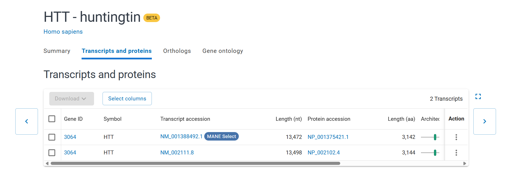

**Ensembl:** https://www.ensembl.org/Homo_sapiens/Gene/Summary?g=ENSG00000197386
Ensembl, en cambio, lista **24 transcriptos** para HTT. Muchos más que NCBI, porque esta base los
detecta de forma automática e incluye también versiones más raras o poco usadas.

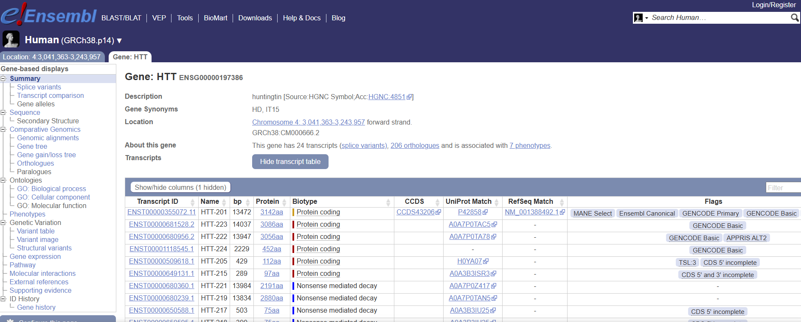

| Base | Nº de transcriptos | Cómo los arma |
|------|--------------------|---------------|
| NCBI RefSeq | **2** | Revisados a mano, alta confianza |
| Ensembl | **24** | Automático, capta más variantes |

**¿Por qué dan números tan distintos?** Como nos llamó la atención la diferencia, lo buscamos y
encontramos la explicación en un foro de bioinformática ([Biostars](https://www.biostars.org/p/72845/)):
RefSeq (NCBI) es una colección **curada** de transcriptos —menos, pero bien confirmados—, mientras que
Ensembl es más **inclusiva** e incorpora muchas variantes, incluso algunas con poco respaldo. O sea:
NCBI prioriza estar seguro de lo que muestra, y Ensembl prioriza mostrar todo lo posible.

**¿Cuáles se expresan y cuál base es más precisa?** La versión principal es la que fabrica la
huntingtina completa, que es la forma importante. Muchas de las 24 de Ensembl son versiones cortas o
poco frecuentes. Por eso **las dos bases sirven para cosas distintas**: NCBI es más confiable (pocas
pero seguras, ideal para uso médico), y Ensembl es más completa (muestra toda la variedad posible,
aunque algunas sean dudosas). Es la misma diferencia que vimos en el punto b).

---

## d) Interacciones proteína–proteína

Qué es esto en simple: las proteínas no trabajan solas, se "enganchan" con otras para hacer su
tarea. Acá miramos con cuántas otras proteínas se relaciona la huntingtina, comparando dos bases:
**NCBI Gene** y **UniProt**.

- **NCBI Gene** (https://www.ncbi.nlm.nih.gov/gene/3064, sección *Interactions*): nos dio una tabla
  con **560 interacciones**.
- **UniProt** (https://www.uniprot.org/uniprotkb/P42858/entry#interaction): nos dio una tabla con
  **860 interacciones**.

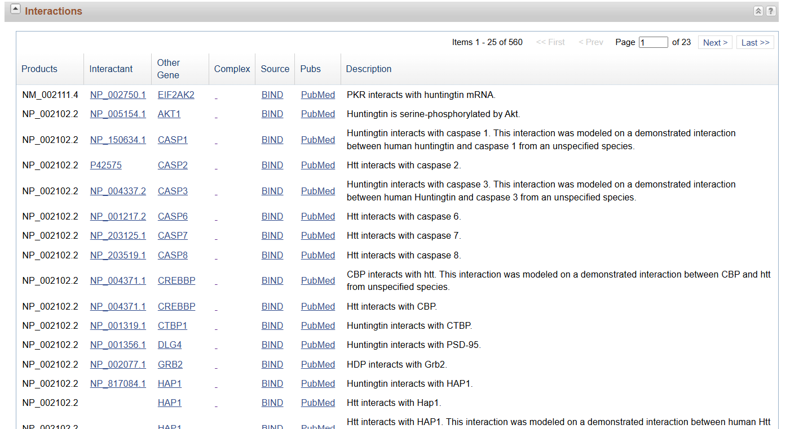

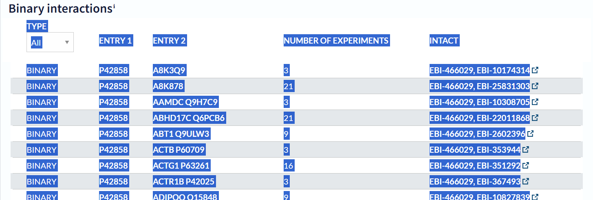

O sea, la huntingtina se relaciona con **muchísimas** otras proteínas. Algunas de las más conocidas:

| Proteína | Para qué |
|----------|----------|
| **HAP1** | Transporte de cargas dentro de la neurona |
| **HIP1** | Ayuda a meter cosas dentro de la célula (endocitosis) |
| **HIP14** | Modifica químicamente a la huntingtina |
| **DCTN1** | Parte del "motor" que mueve cargas dentro de la célula |

**¿Hay un patrón?** Sí: la mayoría de estas proteínas tienen que ver con **mover cosas de un lado a
otro dentro de la neurona** (transporte interno). Eso encaja con la función principal de la
huntingtina, que es justamente ayudar en ese transporte.

**¿Por qué los números no coinciden (560 vs 860)?** Otra vez, como en b) y c): cada base junta los
datos de fuentes distintas y con criterios distintos, así que una lista más interacciones que la otra.
UniProt llegó a un número más alto (860) que NCBI (560), pero las dos coinciden en lo importante: HTT
es una proteína **muy conectada**, lo que muestra que cumple un rol central en la neurona.

---

## e) Gene Ontology (GO): componente, proceso y función

Qué es esto en simple: **Gene Ontology (GO)** es un "etiquetado estándar" que describe cada proteína
respondiendo tres preguntas: **dónde está**, **en qué procesos participa** y **qué hace**. Sacamos
estos datos de la página de UniProt (P42858). El listado completo está en las capturas; acá lo
resumimos agrupado por tema.

**Dónde está (Componente celular):** sobre todo en el **citoplasma** (el interior de la célula) y en
sus **vesículas** (las "cajitas" de transporte), también en el **endosoma** y en el **núcleo**.

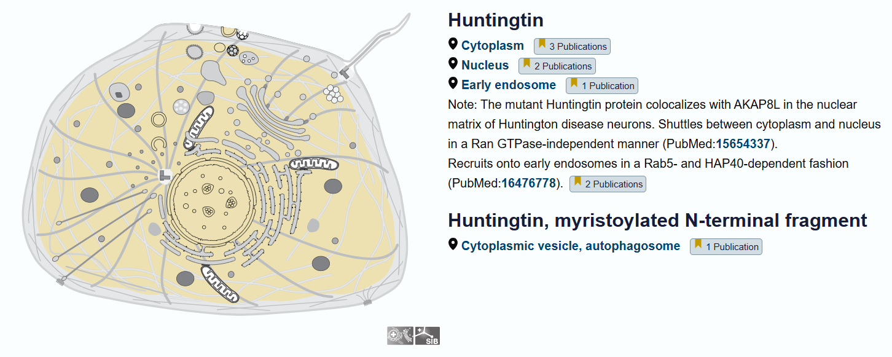

**En qué procesos participa (Proceso biológico):** los ~20 términos se agrupan en pocos temas:
- **Desarrollo del sistema nervioso** (neurogénesis, desarrollo del cerebro).
- **Transporte dentro de la célula** (mover vesículas a lo largo de los microtúbulos, transporte en
  las sinapsis, organización del Golgi).
- **Limpieza/reciclado celular** (autofagia: aggrephagy, lipophagy, mitophagy).
- **Muerte celular programada** (apoptosis) y **señalización** (calcio, cascada CAMKK-AMPK).

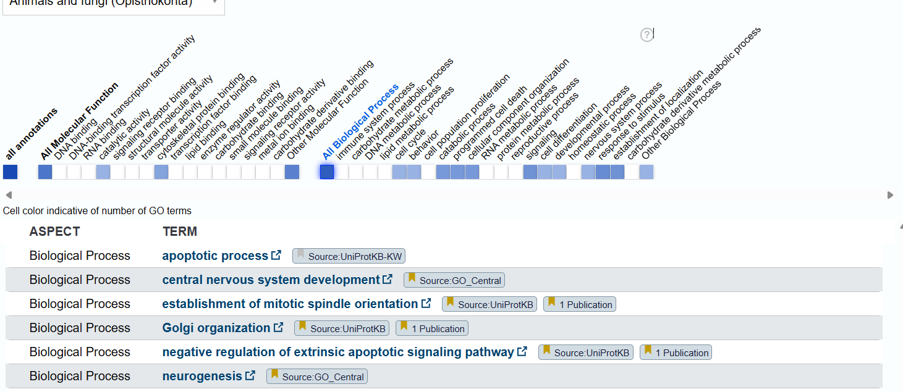

**Qué hace (Función molecular):** principalmente **se une a otras proteínas**. Y casi todas esas
proteínas son del **sistema de transporte** de la célula: se une a *beta-tubulina*, *dinactina* y
*dineína* (las piezas de los "rieles y motores" que mueven cargas dentro de la neurona), además de
unirse a otras proteínas reguladoras (p53, kinasas, proteínas de choque térmico).

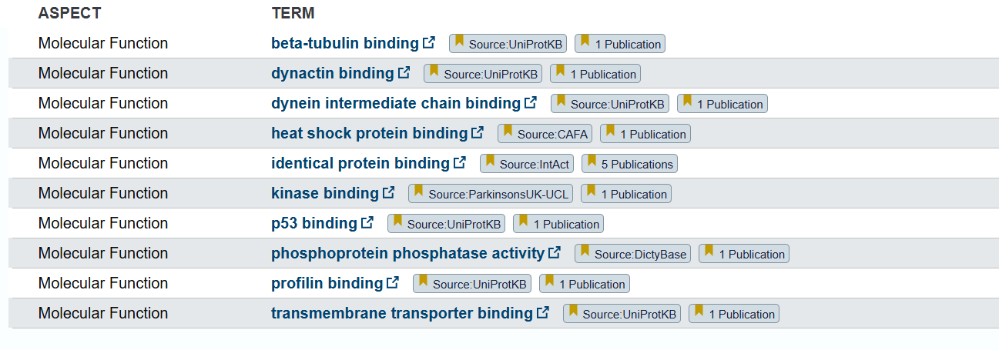

**En resumen:** la huntingtina vive en el **citoplasma y las vesículas**, trabaja sobre todo en el
**transporte interno de la neurona y el desarrollo del cerebro**, y lo hace **uniéndose a las
proteínas del sistema de transporte**. Las tres categorías de GO cuentan la misma historia que ya
veníamos viendo en los puntos anteriores.

---

## f) Vías metabólicas / pathways

Qué es esto en simple: un **pathway** es una "cadena de pasos" donde varias proteínas trabajan juntas
para lograr algo en la célula, como una línea de producción. Acá vimos en qué cadenas participa HTT.

**KEGG:** https://www.genome.jp/dbget-bin/www_bget?hsa:3064
KEGG ubica a HTT en dos pathways, los dos relacionados con la enfermedad:
- **hsa05016 — Huntington disease** (la vía propia de la enfermedad)
- **hsa05022 — Pathways of neurodegeneration** (vía general de enfermedades neurodegenerativas)

Lo interesante es que KEGG además muestra **cómo la huntingtina dañada (mutada) rompe muchas cosas
distintas** dentro de la neurona. Algunos ejemplos que lista:
- frena el **transporte de cargas** dentro de la neurona (axonal),
- altera la **lectura de genes** (transcripción: p53, CREB, REST),
- daña las **mitocondrias** (la "central de energía" de la célula),
- desregula la **autofagia** y la **eliminación de basura** celular (proteasoma),
- dispara la **muerte de la neurona** (apoptosis).

Es decir, un solo gen roto termina afectando un montón de procesos a la vez — por eso la enfermedad
es tan grave. KEGG también muestra que ya hay **medicamentos** apuntando a este gen (Tominersen,
Votoplam), un dato interesante.

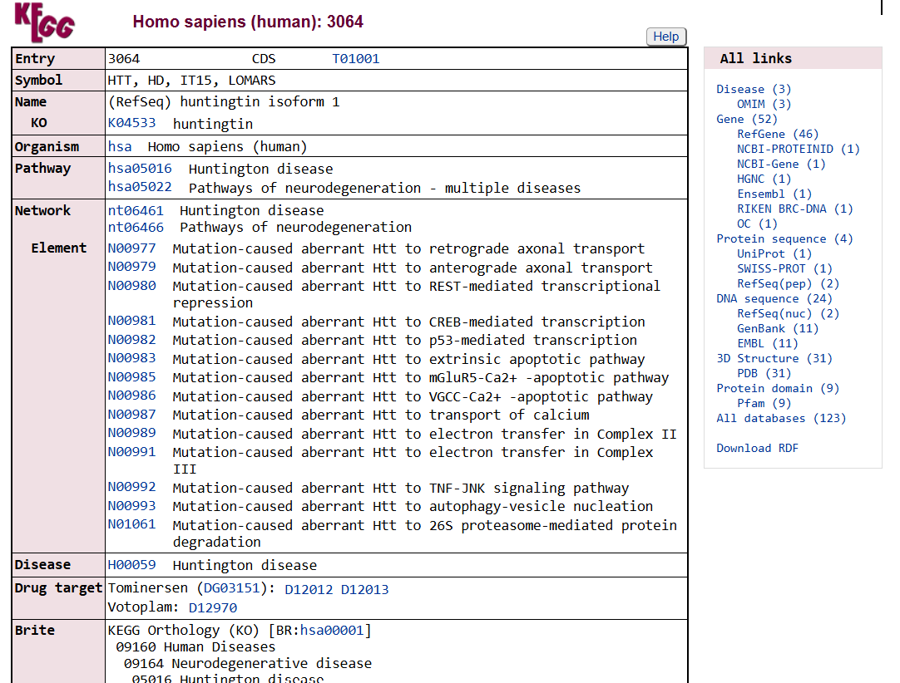

**Patrón:** todos los pathways apuntan a lo mismo que veníamos viendo en GO e interacciones —
**transporte dentro de la neurona, autofagia y neurodegeneración**.

---

## g) Variante genética (dbSNP / ClinVar)

Qué es esto en simple: una **variante** es un "cambio" en el ADN respecto de lo normal. Acá buscamos
la variante que causa la enfermedad de Huntington y qué se sabe de ella.

**La variante:** entramos a **ClinVar** (https://www.ncbi.nlm.nih.gov/clinvar/?term=HTT%5Bgene%5D) y,
filtrando por *Pathogenic*, encontramos **132 variantes** que causan enfermedad en este gen. La
principal —la que causa Huntington— es la **expansión del "CAG"**: en vez de un cambio de una sola
letra, lo que pasa es que un pedacito del ADN (las letras CAG) **se repite de más**. En ClinVar es la
entrada **Variation ID 409**, clasificada como **Pathogenic** para la enfermedad de Huntington, con el
nivel de confianza más alto que da la base (*practice guideline*).

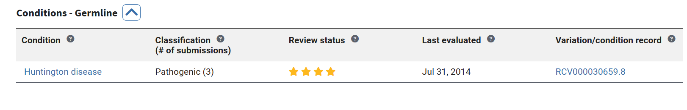

Lo interesante de esta variante es que **cuántas veces se repite el CAG decide si te enfermás y qué
tan grave**:

| Veces que se repite el CAG | Qué pasa |
|----------------------------|----------|
| 35 o menos | Normal (no te enfermás) |
| 36 a 39 | Zona de riesgo (puede o no aparecer) |
| 40 o más | **Aparece la enfermedad de Huntington** |
| 60 o más | Forma juvenil (empieza en la infancia/adolescencia) |

**¿A quiénes afecta más?** Para esto usamos **MedlinePlus** (la base de divulgación de NCBI que
sugiere la consigna). En su sección de frecuencia dice textualmente:

> La enfermedad de Huntington afecta a un estimado de 3 a 7 de cada 100.000 personas de ascendencia
> europea. El trastorno parece ser menos común en algunas otras poblaciones, incluidas las personas
> de ascendencia japonesa, china y africana.

Es decir, la enfermedad es claramente **más frecuente en personas de ascendencia europea** y menos
común en personas de ascendencia japonesa, china y africana.

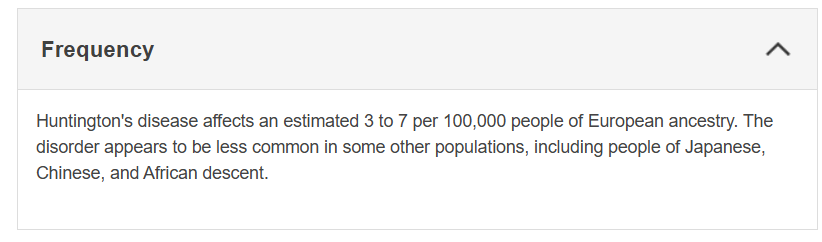

---

## Fuentes

- [NCBI Gene 3064 (HTT)](https://www.ncbi.nlm.nih.gov/gene/3064) · [OMIM #143100](https://omim.org/entry/143100) · [OMIM *613004 (HTT)](https://omim.org/entry/613004)
- [Ensembl ENSG00000197386](https://www.ensembl.org/Homo_sapiens/Gene/Summary?g=ENSG00000197386)
- [UniProt P42858](https://www.uniprot.org/uniprotkb/P42858/entry) · [GeneCards HTT](https://www.genecards.org/cgi-bin/carddisp.pl?gene=HTT)
- [KEGG hsa05016 — Huntington disease](https://www.genome.jp/dbget-bin/www_bget?hsa:3064) · [ClinVar Variation ID 409](https://www.ncbi.nlm.nih.gov/clinvar/variation/409/)
- [MedlinePlus — Huntington disease](https://medlineplus.gov/genetics/condition/huntington-disease/) · [Biostars — RefSeq vs Ensembl](https://www.biostars.org/p/72845/)
- [NCBI Insights — HomoloGene redirige a NCBI Datasets/Gene (2024)](https://ncbiinsights.ncbi.nlm.nih.gov/2024/01/30/homologene-redirects-ncbi-datasets-gene/)
- [Wikipedia — Huntingtin](https://en.wikipedia.org/wiki/Huntingtin)
