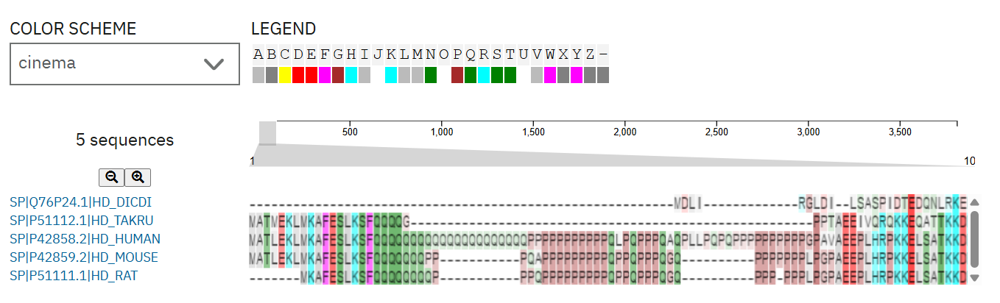

# Trabajo Práctico Parte 1 — Informe de Avance
**Introducción a la Bioinformática — UTN FRBA**  
**Fecha de entrega: 1 de junio de 2026**

---

## 1. Introducción

### Enfermedad elegida: Enfermedad de Huntington

La Enfermedad de Huntington (EH) es una enfermedad hereditaria catalogada en OMIM bajo el número #143100. La elegimos porque tiene una causa genética muy clara y bien documentada, lo que la hace ideal para trabajar con herramientas bioinformáticas. Se caracteriza por un deterioro progresivo que afecta el movimiento, la cognición y el comportamiento, y no tiene cura.

Lo que más nos llamó la atención al investigarla es que no existen portadores sanos: cualquier persona que herede el alelo mutado va a desarrollar la enfermedad en algún momento de su vida. Eso la hace diferente a la mayoría de las enfermedades hereditarias.

**Causa molecular:** la enfermedad es causada por una expansión de repeticiones del triplete CAG en el gen HTT. En personas sanas el número de repeticiones es menor a 36; cuando supera ese umbral, la proteína producida se vuelve tóxica para las neuronas. A mayor número de repeticiones, más grave y más temprana es la enfermedad.

### Gen elegido: HTT (Huntingtin)

El gen HTT está en el cromosoma 4 y codifica para la proteína huntingtina. Según la base de datos SwissProt, la proteína tiene alrededor de 3144 aminoácidos. La secuencia de referencia que usamos en este trabajo es el transcripto **NM_002111.8** obtenido de NCBI Nucleotide.

---

## 2. Ambiente de trabajo

El trabajo fue desarrollado utilizando:

- **Lenguaje:** Python 3.11 con la librería BioPython
- **Ambiente:** contenedor Docker sobre Windows, garantizando reproducibilidad
- **Control de versiones:** repositorio Git en GitHub
- **BLAST:** ejecutado de forma remota contra la base de datos SwissProt del NCBI

Para reproducir el ambiente y ejecutar los scripts:

```bash
docker compose run tp bash
python src/ex1_reading_frames.py
python src/ex2_blast.py
python src/ex3_msa.py
```

---

## 3. Ejercicio 1 — Procesamiento de Secuencias

### Descripción

Se desarrolló el script `src/ex1_reading_frames.py` que realiza las siguientes operaciones:

1. Lee el archivo `data/NM_002111.gb` en formato GenBank usando `Bio.SeqIO`
2. Extrae la secuencia de nucleótidos del mRNA maduro de HTT (13.498 bp)
3. Calcula los **6 marcos de lectura posibles**: +1, +2, +3 sobre la cadena directa y -1, -2, -3 sobre el complemento reverso
4. Traduce cada marco a su secuencia de aminoácidos usando la tabla de código genético estándar
5. Escribe los 6 resultados en el archivo `output/orfs.fasta` en formato FASTA

**Nota de implementación:** Al investigar las herramientas disponibles se encontró que BioPerl ofrece `Bio::SeqUtils->translate_6frames()`, función que calcula los 6 marcos de lectura incluyendo los frames negativos (-1, -2, -3) sobre el complemento reverso de la secuencia, y devuelve 6 objetos de secuencia directamente utilizables. BioPython cuenta con `Bio.SeqUtils.six_frame_translations()` que realiza el mismo cálculo pero devuelve un string formateado para visualización, no objetos procesables. Por este motivo se implementó la función `get_six_frames()` utilizando las primitivas `seq.reverse_complement()` y `seq.translate()`, reproduciendo el comportamiento de la función de BioPerl.

### Resultados

| Frame | Aminoácidos antes del primer stop | Observación |
|-------|----------------------------------|-------------|
| +1 | 131 | Stop prematuro |
| **+2** | **3192** | **Frame correcto** |
| +3 | 27 | Stop prematuro |
| -1 | 23 | Stop prematuro |
| -2 | 13 | Stop prematuro |
| -3 | 5 | Stop prematuro |

**El frame correcto es el +2**, con 3192 aminoácidos antes del primer codón de stop, coherente con el tamaño conocido de la huntingtina humana (~3144 aa). Los otros 5 marcos producen proteínas truncadas de menos de 132 aminoácidos, lo que indica que no corresponden al marco de lectura real.

### Conclusión del ejercicio

Lo que más me llamó la atención al ver los resultados fue la diferencia de longitudes: el frame +2 produce 3192 aminoácidos antes del primer stop, y el segundo mejor llega solo a 131. No hacía falta saber de antemano cuál era el correcto — la diferencia es tan grande que se ve sola. Igual, en este ejercicio no determinamos el frame correcto: eso lo confirmamos recién en el ejercicio 2 con BLAST, que es el criterio más sólido.

---

## 4. Ejercicio 2a — BLAST

### Descripción

Se desarrolló el script `src/ex2_blast.py` que:

1. Lee los 6 frames del archivo `output/orfs.fasta` (output del Ejercicio 1)
2. Ejecuta una búsqueda **blastp remota** contra SwissProt del NCBI para cada frame usando `Bio.Blast.NCBIWWW`
3. Guarda todos los resultados en `output/blast.xml` (para el Ejercicio 3) y en `output/blast.out` (reporte legible en texto plano)
4. Muestra un resumen por frame indicando cuántos hits significativos obtuvo cada uno

### Resultados

El BLAST remoto se corrió sobre los 6 frames para identificar el correcto sin conocimiento previo. Solo el frame +2 produjo hits significativos:

| Frame | aa antes del stop | Hits significativos | Mejor E-value |
|-------|-------------------|---------------------|---------------|
| +1 | 131 | 0 | — |
| -1 | 23 | 0 (E-value: 1.40) | — |
| **+2** | **3192** | **5** | **0.0** |
| -2 | 13 | 0 | — |
| +3 | 27 | 0 | — |
| -3 | 5 | 0 | — |

Los 5 hits del frame +2:

| # | Proteína | Organismo | Identity | E-value | Score |
|---|----------|-----------|----------|---------|-------|
| 1 | Huntingtin (HD_HUMAN) | *Homo sapiens* | 99.9% | 0.0 | 16720 |
| 2 | Huntingtin (HD_MOUSE) | *Mus musculus* | 91.2% | 0.0 | 14691 |
| 3 | Huntingtin (HD_RAT) | *Rattus norvegicus* | 90.8% | 0.0 | 14620 |
| 4 | Huntingtin (HD_TAKRU) | *Takifugu rubripes* | 69.7% | 0.0 | 11538 |
| 5 | HD protein homolog | *Dictyostelium discoideum* | 28.8% | 8.22e-19 | 244 |

### BLAST local

Además del BLAST remoto, se ejecutó un BLAST local contra una copia descargada de SwissProt (482.697 secuencias). Se descargó la base de datos en formato FASTA desde el FTP del NCBI y se la formateó con `makeblastdb`. El query utilizado fue el mismo que en el BLAST remoto: la secuencia proteica del frame +2 extraída de `output/orfs.fasta` (3192 aa). El comando ejecutado fue:

```
blastp.exe -db C:\Users\herna\facu\bioinformatica-2026\tp-bioinformatica-2026\data\swissprotdb\swissprot -query C:\Users\herna\facu\bioinformatica-2026\tp-bioinformatica-2026\output\orfs.fasta -out C:\Users\herna\facu\bioinformatica-2026\tp-bioinformatica-2026\output\local-ncbi-blast-repos.txt
```

El resumen de hits significativos producido por BLAST para el frame +2:

```
Query= NM_002111.8_frame_+2

Sequences producing significant alignments:                          (Bits)  Value

P42858.2 RecName: Full=Huntingtin [Homo sapiens]                     6397    0.0
P42859.2 RecName: Full=Huntingtin [Mus musculus]                     5616    0.0
P51111.1 RecName: Full=Huntingtin [Rattus norvegicus]                5589    0.0
P51112.1 RecName: Full=Huntingtin [Takifugu rubripes]                4424    0.0
Q76P24.1 RecName: Full=HD protein homolog [Dictyostelium discoideum]   97.4    3e-18
```

Los resultados son consistentes con el BLAST remoto, confirmando ambos análisis:

| # | Accesión | Proteína | Organismo | Identidad | E-value | Bit score |
|---|----------|----------|-----------|-----------|---------|-----------|
| 1 | P42858.2 | Huntingtin (HD_HUMAN) | *Homo sapiens* | 99% (3142/3144) | 0.0 | 6397 |
| 2 | P42859.2 | Huntingtin (HD_MOUSE) | *Mus musculus* | 91% (2792/3063) | 0.0 | 5616 |
| 3 | P51111.1 | Huntingtin (HD_RAT) | *Rattus norvegicus* | 91% (2781/3063) | 0.0 | 5589 |
| 4 | P51112.1 | Huntingtin (HD_TAKRU) | *Takifugu rubripes* | 70% (2245/3223) | 0.0 | 4424 |
| 5 | Q76P24.1 | HD protein homolog | *Dictyostelium discoideum* | 29% | 3e-18 | 97.4 |

El hit 1 muestra 99% (3142/3144) y no 100% porque la traducción del frame +2 incluye 2 aminoácidos extra en el N-terminal respecto a la secuencia curada de SwissProt (P42858.2, 3142 aa), lo que genera 2 gaps en el alineamiento. Esto es esperable: el frame +2 traduce desde la posición 2 del mRNA crudo, mientras que la secuencia SwissProt representa la proteína procesada y anotada manualmente.


---

## 5. Ejercicio 2b — Interpretación del resultado BLAST

### Significado de los valores estadísticos

**E-value (Expect value):** es la cantidad de hits que esperarías encontrar por azar en una base de datos del tamaño de SwissProt con una puntuación igual o mejor. Un E-value de 0.0 significa que esa probabilidad es tan pequeña que Python la redondea a cero — el hit es real. El hit 5 (Dictyostelium) con E-value de 8.22e-19 también es significativo: hay 1 en 10^19 chances de que esa similitud sea producto del azar. En general, se considera significativo cualquier E-value menor a 0.001.

**Identity %:** porcentaje de aminoácidos idénticos en el alineamiento. Los hits 2, 3 y 4 (ratón, rata y pez globo) presentan alta identidad con la huntingtina humana, lo que indica que el gen HTT está fuertemente conservado en vertebrados.

**Score:** mide la calidad del alineamiento sumando puntos por cada posición — aminoácidos idénticos suman más, similares suman menos, gaps restan. Existen dos variantes: el **raw score** depende de los parámetros de configuración usados y no es comparable entre distintas corridas; el **bit score** es una versión normalizada del raw score que sí es comparable entre cualquier corrida de BLAST. Por eso el BLAST remoto y el local reportan scores distintos para los mismos hits: el remoto usa raw score y el local bit score.

### Interpretación biológica

Los primeros 4 hits corresponden a la huntingtina de otros vertebrados, con identidades superiores al 69%. Esto demuestra que HTT es un gen altamente conservado en vertebrados, lo que implica que cumple funciones celulares fundamentales más allá de la patología asociada en humanos.

El hit más sorprendente es el número 5: *Dictyostelium discoideum*, que es una ameba unicelular. No esperábamos encontrar un homólogo de huntingtina en un organismo tan distinto a los vertebrados. Con 28.8% de identidad todavía tiene regiones similares, lo que sugiere que este gen existe desde hace muchísimo tiempo y probablemente cumple alguna función básica en la célula.

### Conclusión del ejercicio

Correr BLAST sobre los 6 frames sin saber cuál era el correcto resultó ser la forma más directa de identificarlo: solo el frame +2 dio hits reales, todos los demás no encontraron nada. Eso ya responde la pregunta del ejercicio 1.

Lo que no esperaba era la ameba. Que exista un homólogo en *Dictyostelium discoideum* me hizo entender que la huntingtina no es solo una proteína asociada a una enfermedad humana — debe tener alguna función más básica que se conservó a lo largo de la evolución. También fue útil comparar el BLAST remoto con el local: los dos dieron los mismos 5 hits en el mismo orden, lo que me da más confianza en los resultados.

---

## 6. Ejercicio 3 — Multiple Sequence Alignment (MSA)

### Descripción

Se desarrolló el script `src/ex3_msa.py` que descarga automáticamente las secuencias proteicas de los 5 hits encontrados en el BLAST desde NCBI usando `Bio.Entrez`. Las secuencias fueron guardadas en `output/msa_input.fasta` y el alineamiento múltiple fue realizado con **Clustal Omega** (versión online, EMBL-EBI). El resultado se guardó en `output/msa.aln`.

Las especies incluidas en el MSA son:

| Código | Especie | Identidad con HTT humana |
|--------|---------|--------------------------|
| HD_HUMAN | *Homo sapiens* | referencia |
| HD_MOUSE | *Mus musculus* | 91.2% |
| HD_RAT | *Rattus norvegicus* | 90.8% |
| HD_TAKRU | *Takifugu rubripes* (pez globo) | 69.7% |
| HD_DICDI | *Dictyostelium discoideum* (ameba) | 28.8% |

### Interpretación del alineamiento

Al abrir el archivo de alineamiento lo primero que se ve son los símbolos `*`: indican posiciones donde todas las especies tienen el mismo aminoácido. Hay muchos en la parte central y final de la secuencia, lo que significa que esas regiones se mantuvieron iguales a lo largo de la evolución.

Lo más llamativo está al principio de la secuencia:

```
HD_HUMAN   MATLEKLMKAFESLKSFQQQQQQQQQQQQQQQQQQQPPPPP...
HD_MOUSE   MATLEKLMKAFESLKSFQQQQQQQQPP...
HD_RAT     -------MKAFESLKSFQQQQQQQQP...
HD_TAKRU   MATMEKLMKAFESLKSFQQQQG...
HD_DICDI   ----------------------------------------------------------MD
```

La secuencia humana tiene una cadena mucho más larga de Q repetidas que el resto de las especies. Esa región es exactamente donde ocurre la expansión de repeticiones CAG que causa la enfermedad — cada Q en la proteína corresponde a un CAG en el ADN. Verlo directamente en el alineamiento fue bastante impactante porque conecta todo el análisis con la causa molecular de la enfermedad.

En el resto de la secuencia, ratón y rata son muy similares a la humana. El pez globo tiene más diferencias pero todavía comparte bastantes posiciones. La ameba es la que más gaps tiene y menos `*` muestra, aunque aparecen algunos bloques conservados en distintos lugares de la secuencia.

### Conclusión del ejercicio

Al ver el alineamiento lo primero que se nota es que ratón y rata son casi iguales a la secuencia humana, lo cual tiene sentido porque son mamíferos. El pez globo ya diverge más pero todavía comparte regiones. La ameba tiene la mayor cantidad de gaps y es la más distinta, pero que aparezca en el alineamiento con bloques conservados es lo que más me sorprendió de todo el trabajo. También fue interesante poder ver directamente en el alineamiento la región de glutaminas (Q) que causa la enfermedad — los humanos tienen una cadena mucho más larga que el resto.



*Resultado completo del MSA disponible en: https://www.ebi.ac.uk/jdispatcher/msa/clustalo/summary?jobId=clustalo-I20260526-034619-0482-90639946-p1m*

---

## 7. Conclusión

Este trabajo me resultó más interesante de lo que esperaba. Empezamos con un archivo de texto en formato GenBank y terminamos viendo en el alineamiento la región exacta que causa la enfermedad.

Lo que más me quedó fue la progresión: el ejercicio 1 traduce los 6 frames sin saber cuál es el correcto, el ejercicio 2 lo identifica a través de BLAST, y el ejercicio 3 permite visualizar las diferencias entre especies. Cada paso tiene sentido en función del siguiente.

La sorpresa fue la ameba. Que un organismo tan distinto a nosotros tenga una versión del mismo gen sugiere que la proteína cumple alguna función muy básica — algo que no habría notado sin hacer el análisis. Y ver en el alineamiento que la cadena de Q repetidas es más larga en humanos que en cualquier otra especie cierra el círculo con la causa molecular de la enfermedad.

---

## Anexo — Cómo ejecutar los scripts

**Requisitos:** Docker Desktop instalado y corriendo.

```bash
# Clonar el repositorio
git clone https://github.com/[usuario]/tp-bioinformatica-2026

# Entrar al contenedor
docker compose run tp bash

# Ejecutar ejercicios
python src/ex1_reading_frames.py   # Genera output/orfs.fasta
python src/ex2_blast.py            # Genera output/blast.out
python src/ex3_msa.py              # Descarga secuencias para MSA
```

Los archivos de input (`data/NM_002111.gb`) y output (`output/`) se encuentran en el repositorio.
